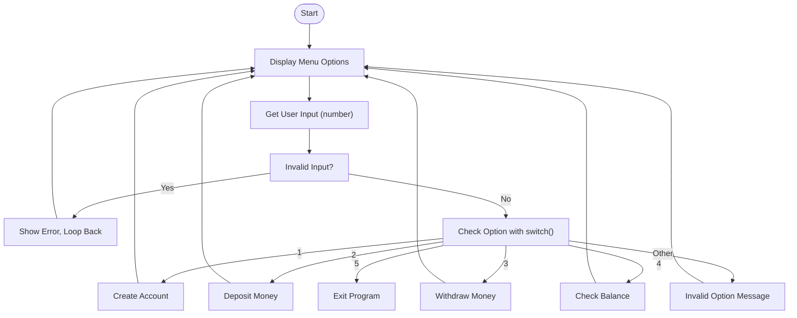

```mermaid
flowchart TD
    Start([Start])
    Menu["Display Menu Options"]
    Input["Get User Input (number)"]
    Invalid["Invalid Input?"]
    TryAgain["Show Error, Loop Back"]
    Switch["Check Option with switch()"]
    Option1["Create Account"]
    Option2["Deposit Money"]
    Option3["Withdraw Money"]
    Option4["Check Balance"]
    Option5["Exit Program"]
    Default["Invalid Option Message"]

    Start --> Menu
    Menu --> Input
    Input --> Invalid
    Invalid -- Yes --> TryAgain --> Menu
    Invalid -- No --> Switch

    Switch -- 1 --> Option1 --> Menu
    Switch -- 2 --> Option2 --> Menu
    Switch -- 3 --> Option3 --> Menu
    Switch -- 4 --> Option4 --> Menu
    Switch -- 5 --> Option5
    Switch -- Other --> Default --> Menu
```
